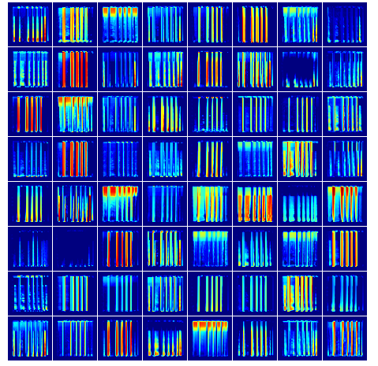

# Sound_Classification_Spectrograms
This repository contains code for classification of sound using spectrograms. We train a CNN to classify the sounds after converting to spectrogram.

## Activation Map - Dog Voice

